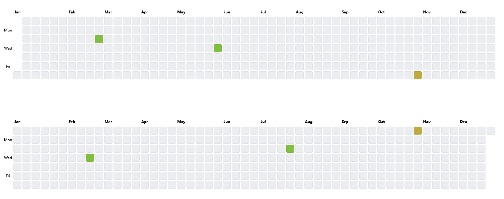

# contribution graphs

### Introduction

Create GitHub-like contribution graphs. 



### Usage

```html
<!doctype html>

<html>

<head>
    <meta http-equiv="X-UA-Compatible" content="IE=edge">

    <meta charset="utf-8">
    <meta content="contribution-graph" name="description" />

    <title>contribution-graph</title>

    <style>
        div {
            margin-top: 100px;
        }
        table.contributionGraph {
            border-collapse: separate;
            border-spacing: 3px;
        }

        table.contributionGraph th,
        table.contributionGraph td {
            width: 20px;
            height: 20px;
            text-align: center;
            font-size: 10px;
        }

        table.contributionGraph .contribution-day {
            background-color: #ebedf0;
            border-radius: 3px;
            outline: 1px solid rgba(27, 31, 35, 0.06);
            outline-offset: -1px;
        }
    </style>

</head>

<body>
    <div id='graph1'></div>

    <div id='graph2'></div>

    <script type="module" src='./src/main.js'>

    </script>
</body>

</html>
```

```js
// ./src/main.js
import create_graph from './create-graph'

let contributions_data1 = {
    '2022-03-01': 3,
    '2022-11-05': 7,
    // ... add more dates and contributions here
},

contributions_data2 = {
    '2023-03-01': 3,
    '2023-11-05': 7,
    // ... add more dates and contributions here
};

let graph1 = create_graph('#graph1', contributions_data1),
graph2 = create_graph('#graph2', contributions_data2);

setTimeout(function(){
    graph1.update('2022-06-01', 3);
    graph2.update('2023-08-01', 3);
}, 3000)
```

### API

`function create_graph(graph_selecter, contributions)` return graph object

`graph.update(date, value)` update a single day

You can change the style of the graph with CSS class `table.contributionGraph` and `.contribution-day`
